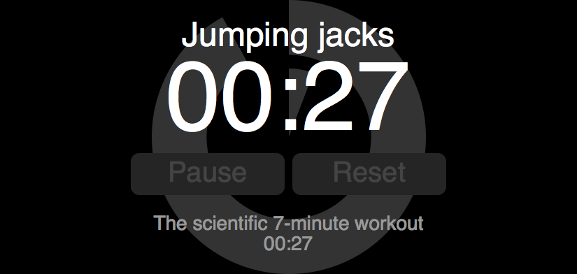

### SHOUTING COACH :loudspeaker:

Excercising app. Helps me work out. Created because other apps ...
- didn't let me create a **custom workout**    
  so I can change that one impossible 'spine cracker cross crunches' with something doable
- didn't blow up on **HUGE SCREENS**   
  so I can read it without glasses
- didn't have **BIG BUTTONS** and hard to miss keyboard short cuts    
  hitting tiny buttons when you're working out is hard
- didn't **talk** to me    
  When I'm doing push-ups I'm not watching the frikkin screen, yo.

### uses
these MIT licensed libraries:
- require.js
- buzz.js (<- the only sound lib I could find that played in _every_ dmn browser)
- jquery (plan to get rid of that)

### licensed
[GPLv3](LICENSE)

### flair

So code coverage < 90%? Yep. [Working on it](https://github.com/sverweij/shoutingcoach/tree/master/src/script/test).
